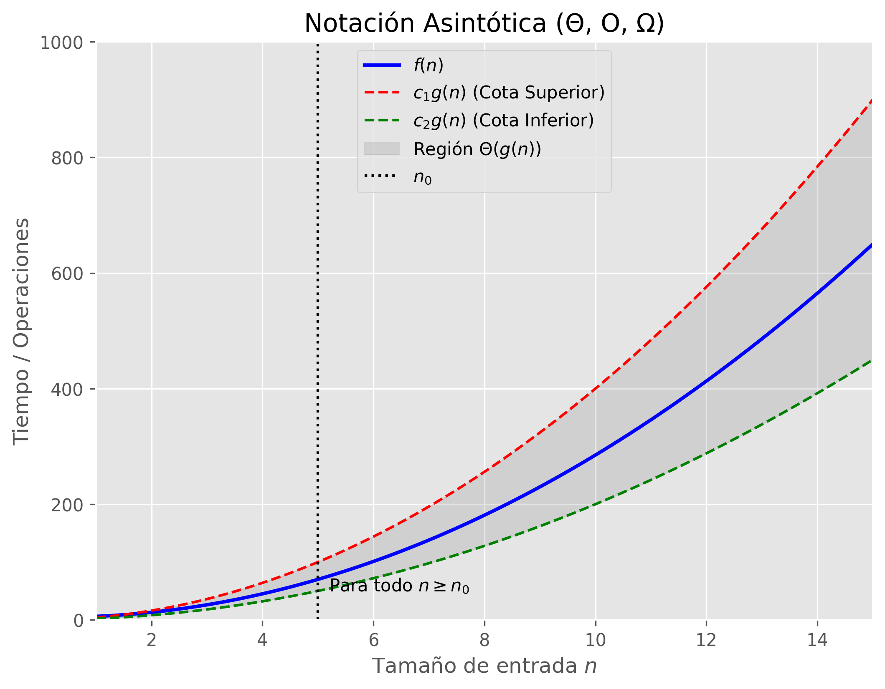

# 3.1 Notación Asintótica (Asymptotic Notation)

La notación asintótica es una herramienta matemática utilizada en ciencias de la computación para describir el comportamiento límite del tiempo de ejecución (o complejidad espacial) de un algoritmo cuando el tamaño de la entrada `n` tiende a infinito. Nos permite clasificar algoritmos según su rendimiento e ignorar las constantes y los términos de menor orden.

Típicamente utilizamos estas notaciones para analizar algoritmos de forma teórica, sin enfrascarnos en limitaciones exactas de hardware o conteos de ciclos.

---

## 1. Notación Θ (Theta) -> Cota Ajustada (Tight Bound)
La notación Θ delimita una función por **arriba y por abajo**. Si una función `f(n) = Θ(g(n))`, significa que `f(n)` crece exactamente a la misma tasa que `g(n)` asintóticamente.

**Definición matemática:**
`f(n) = Θ(g(n))` si existen constantes positivas `c1, c2, n0` tales que:
`0 <= c1 * g(n) <= f(n) <= c2 * g(n)` para todo `n >= n0`.

**Ejemplo:**
Para `f(n) = 3n^2 - 2n + 5`:
- A medida que `n` tiende a infinito, el término `n^2` domina al resto.
- Por lo tanto, `f(n) = Θ(n^2)`.

---

## 2. Notación O (Big-O) -> Cota Superior (Upper Bound)
La notación O proporciona una **cota superior asintótica**. Nos da la tasa máxima de crecimiento, lo que significa que en el peor de los casos, el algoritmo tomará *a lo sumo* esta cantidad de tiempo.

**Definición matemática:**
`f(n) = O(g(n))` si existen constantes positivas `c, n0` tales que:
`0 <= f(n) <= c * g(n)` para todo `n >= n0`.

**Ejemplo:**
Si un algoritmo toma `f(n) = 3n^2 - 2n + 5` pasos, está limitado superiormente por `n^2`, así que `f(n) = O(n^2)`. Técnicamente, también es correcto decir que `f(n) = O(n^3)` porque `n^3` crece más rápido que `n^2`.

---

## 3. Notación Ω (Big-Omega) -> Cota Inferior (Lower Bound)
La notación Ω proporciona una **cota inferior asintótica**. Significa que el algoritmo tomará *por lo menos* esta cantidad de tiempo.

**Definición matemática:**
`f(n) = Ω(g(n))` si existen constantes positivas `c, n0` tales que:
`0 <= c * g(n) <= f(n)` para todo `n >= n0`.

**Ejemplo:**
Para el algoritmo de ordenamiento por inserción (insertion sort), el tiempo de ejecución en el mejor de los casos (cuando el arreglo ya está ordenado) es `Ω(n)`.

---

## 4. Notación o (Little-o) -> Cota Superior Estricta
A diferencia de Big-O, que puede ser una cota ajustada, el little-o representa una cota superior que **no es asintóticamente ajustada**.

`f(n) = o(g(n))` significa que `f(n)` crece estrictamente de forma más lenta que `g(n)`.
Ejemplo: `2n = o(n^2)`, pero `2n^2 != o(n^2)`.

## 5. Notación ω (Little-omega) -> Cota Inferior Estricta
De manera similar al little-o, la little-omega representa una cota inferior que **no es asintóticamente ajustada**.

`f(n) = ω(g(n))` significa que `f(n)` crece estrictamente más rápido que `g(n)`.
Ejemplo: `n^2 = ω(n)`, pero `n^2 != ω(n^2)`.

---

## Analogía con los Números Reales

Puedes imaginar las notaciones asintóticas como operadores relacionales que comparan el crecimiento de las funciones:

*   `f(n) = O(g(n))  ≈  a <= b`
*   `f(n) = Ω(g(n))  ≈  a >= b`
*   `f(n) = Θ(g(n))  ≈  a == b`
*   `f(n) = o(g(n))  ≈  a < b`
*   `f(n) = ω(g(n))  ≈  a > b`

---

## Visualizando las Cotas Asintóticas

Hemos proporcionado un script de Python en esta carpeta llamado `plot_asymptotic.py`. 
Al ejecutarlo usando `python3 plot_asymptotic.py` (requiere tener instalado `matplotlib` y `numpy`), se generará la imagen `asymptotic_bounds.png`. Esta gráfica muestra de forma visual cómo `f(n)` se encuentra atrapada entre los límites de `c1 * g(n)` y `c2 * g(n)`, para demostrar la región Θ.

 *(Una vez que generes la gráfica corriendo el script, la imagen aparecerá aquí)*
